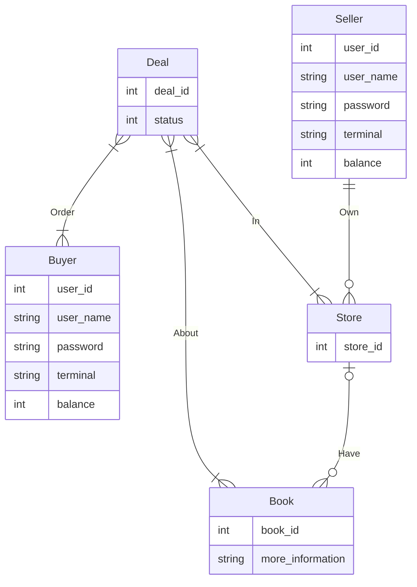

# 第二次大作业

本篇报告按照应用设计到测试的流程攥写. 个别子标题会注明它对应了哪个文件, 代码是谁写的. 

实际工作上经历过几次返回前一步骤重新迭代的过程, 在报告末尾会稍微提及其中的艰难坎坷. 

## 1. 文件结构

本次大作业采用了后端应用常用的MVC结构进行开发. (MVC: 指Model-View-Controller, 是一个非常古老的后端应用设计模板)

其中view层和controller层的代码合在一起, 放在view文件夹下. 

model层放在relations文件夹下, 提供了各种单个事务级别的函数(因而具有原子性), 用于操作表. 

而我们把测试从fe当中拿了出来, 并删除了大量的垃圾代码(200行左右?), 并将重写后修正逻辑错误的测试放在后端的工作目录当中. 

```
.
├── __init__.py
├── relations
│   ├── buyer.py
│   ├── init.py
│   ├── scripts
│   │   ├── book.sql
│   │   ├── name_replacer.py
│   │   └── upload_book.py
│   ├── seller.py
│   └── user.py
├── run.py
├── tests
│   ├── test_auth.py
│   ├── test_buyer.py
│   └── test_seller.py
└── view
    ├── __init__.py
    ├── auth.py
    ├── buyer.py
    └── seller.py
```

## 2. 表设计

### 2.1 业务逻辑(@汤越, 杨天骥, 邹越溪)

从买方用户看来, 他能够查找书本, 购买书本, 查看自己的订单状态, 付款, 退货. 

从卖方用户看来, 他能够创建商店, 添加书本信息(书本信息独立于商店), 将书本放入自己的商店, 收款. 

### 2.2 ER图(@汤越, 杨天骥, 邹越溪)



### 2.3 从ER图到分表(@汤越, 杨天骥, 邹越溪)


### 2.4 DDL操作(@汤越, 杨天骥: /relations/init.py)

为了方便测试和后续的修改, 我们将相关的DDL操作封装成了相应的函数. 

每次进行测试时, 通过调用这些操作将表重新初始化. 具体地, 我们向表中导入book.db(作业中提供的从豆瓣上爬下来的图书信息), 并将其他的表重新建表. 

通过这样做, 如果后续发现表当中不能提供功能扩展所需的足够信息或出于性能的考量需要添加冗余列的时, 可以直接修改表对应的类, 而不用手动去数据库中执行操作. 

当然, 在这部分DDL工具函数的开发过程中, 我们也遇到了一些问题, 后来发现是sqlalchemy建表时保留了大写字母, 因此我们书写相应的DROP语句时, 需要将表的名字上加上双引号......

### 2.5 索引(@汤越, 杨天骥: /relations/init.py)

- 通过运行时反射, python语言中, 能够获取一个类对象(一个类, 但本身是一个对象, 有时也叫cls对象)的所有子类. 

  sqlalchemy实现了这种机制. 首先我们生成一个Base类对象, 而后通过继承它来生成若干个表. 

- sqlalchemy中, 如果规定了多个属性满足primary_key=True, 则为其联合索引创建一个primary_key
- 通过index=True, 可以在单列上创建索引. 

## 3. 构建应用: Model层接口

Model层接口提供对数据库的原子操作, 之后由View层/Controller层调用这些接口响应前端请求. 

### 3.1 User接口(@邹越溪: /be/relations/user.py)


### 3.2 Buyer接口(@汤越, 杨天骥: /be/relations/buyer.py)

该文件中定义了一些买书人的行为. 

`new_order(user_id: int, store_id: int, id_and_num: List[Tuple[str, int]]) -> Tuple[int, str, List]:`

- 函数概述: 用户下单
- 实现逻辑: 判断用户存在与否，判断店家存在与否，遍历用户要购买的书籍和数量，生成对应的订单，并加入到`Deal`表中

`payment(user_id: int, store_id: int) -> Tuple[int, str]:`

- 函数概述: 用户付钱

- 实现逻辑: 

  - 从deal的表中找出所有这个客户刚刚下单的所有图书的信息，并进行传入值检查，如果发现传入值有误，则进行一些列报错. `SELECT * FROM deal WHERE uid=user_id and sid=store_id and status=deal_status["下单"]`

  - 计算这笔交易的总金额为多少,获取用户的账户金额信息，select balance from Buyer where uid=user_id,如果账户金额小于图书总金额，报错，调用error函数
      如果账户金额足够支付，则：
      1. 扣款,更新账户信息 update Buyer set balance = new_balance
      2. 商家的账户进账 update Seller set balance = new_balance
      3. 所有图书的交易记录的状态进行更改 update Deal set status=deal_status["付款"]
      4. 结束commit

`add_funds(user_id, pwd，add_value)` 

- 函数概述: 用户充钱
- 实现逻辑: 查询用户信息，进行用户id和密码的匹配，匹配上则进行收付款。

`receive_book(user_id, sid, did)` 

- 函数概述: 用户收到书籍
- 实现逻辑: 根据用户id和商家id对`Deal`表中的这一单的订单的状态进行修改. 

`history(uid)`

- 函数概述: 用户查询自己已经订过的订单信息

- 实现逻辑: 从`Deal`表中查询所有满足 `Deal.uid == uid` 的行, 返回这些行依字段名转成的字典对象

`cancel_deal(uid, did)` 

- 函数概述: 用户选择取消订单号为`did`的订单
- 实现逻辑: 从 `Deal` 表中查询满足 `Deal.did == did` 的订单
  - 如果商家还未发货, 将书籍的存量还给商家, 将订单状态设为取消0(为什么不是删除? 减少索引的操作)
    - 如果用户已经付款, 则把钱退还给用户, 把商家拿到的钱扣掉. 反之不进行这个操作. 
  - 如果商家已经发货, 返回异常. 
  - 上述操作在一个事务中完成, 而后提交. 

### 3.3 Seller接口(@杨天骥, 汤越: /be/relations/seller.py)

该文件中定义了一些卖书人(商家)的行为: 

`create_ store(uid, sid)`

- 函数概述: 为一个商家用户添加一个商店
- 实现逻辑: 在StoreOwner中添加一个(uid, sid)行

`add_book(...)` 

- 函数概述: 可以添加书的信息
- 实现逻辑: 在`Book`表中添加一行带有书信息的行

`add_stock_level(uid, sid, bid, stock_level_delta)` 

- 函数概述: 将书添加入书店, 也可以添加书店中某本书的存量
- 实现逻辑: 更新 `Store` 表: 
  - 如果没有`(书的id: bid, 店的id: sid)`的列, 那么添加一列, 使得price为NULL(这样交易时就会产生Exception而失败, 只有商家主动设置了价格, 这本书才会上架贩卖). 
  - 如果有 `(书的id: bid, 店的id: sid)` 的列, 那么在存量上加上相应的值. 

`change_price(sid, bid, price)`

- 函数概述: 将商店中的某本书价格改为店家制定的价格. 
- 实现逻辑: 更新 `Store` 表: 
  - 如果店家没有上架这本书, 返回异常. 
  - 如果有, 则将这本书的价格改为`price`

`query_stock_level(sid, bid)` 

- 函数概述: 用于查询书店中某本书的存量. 
- 实现逻辑: 查询 `Store` 表中商店id为`sid`, 书id为 `bid` 的表, 返回其存量属性. 

`shipping` 

- 函数概述: 商家发货
- 实现逻辑: 由于购买阶段存货就已经减少, 这里只需要检查用户是否已经付款, 并把交易状态改为发货即可. 

### 3.4 应用层的并发控制(@杨天骥: /be/relations/\*)

应用层也有并发控制的问题. 在现代的后端应用框架中, 往往有自动并发的功能. 这使得即便使用了transaction, 线程之间的竞争也可能使得COMMIT前的指令有交叉. 从而分割了原子性. 为此, 成熟的数据库都配有相应的session机制, 各个session之间满足隔离性. 

这造成了另一个问题: session的开启和关闭都是很贵的操作, 如果每个事务都需要连接开启一个新的session, 那么系统性能会显著降低. 

幸好sqlalchemy提供了一个session池, 通过session maker, 可以从session池当中获得session, 这个session池保证每个session至多被一个线程使用, 并且除非手动关闭, 当前线程会一直持有这个session. 这样, 每个session在一个事务中只会被一个线程写, 保证了没有写交叉的同时, 也避免了session的频繁开启和关闭, 提高了应用的性能. 

## 4. 构建应用: View层接口

### 4.1 User接口(@邹越溪: /be/view/user.py)

该文件负责用户的公共行为. 

### 4.2 Buyer接口(@汤越: /be/view/buyer.py)

该文件中是买书者的特殊行为. 

- 

### 4.3 Seller接口(@杨天骥: /be/view/seller.py)

该文件中是卖书人的特殊行为. 

`create_store`

- 函数概述: 商家创建一个商店

- 实现逻辑: 调用

`add_book`

- 函数概述: 添加一本书

- 提供书的各种信息, 将书本放入书本表中, 书本表会分配一个书本id给这本书. 

- 同时, 书的信息会被拆分放入检索表, 主要供全文搜索使用. 

`add_stock_level`

- 这个接口可以用于将书本加入商店, 也可以用于增加存量. 

- 由于书本在商店中的挂牌价格是NULL, 这本书不会进入之后的交易流程. 

`change_price`

- 商家为商店中的书添加价格. 

`query_stock_level`

- 商家查询书本存量

`shipping`

- 商家发货, 改变一本书的订单的状态

## 5. 模拟操作逻辑, 进行测试

测试覆盖了每个view接口的每种可能输出(包括异常情况). 确保在测试提供的场景下, 每种输出都被产生过一次. 

再高要求的测试覆盖率(遍历系统的所有状态路径/遍历系统的所有控制流图中的边, 称为路径覆盖率/边覆盖率), 通常需要运行到地球爆炸才能完成. [关于测试覆盖率类型, 请参考wikipedia](https://zh.wikipedia.org/zh-hans/%E4%BB%A3%E7%A2%BC%E8%A6%86%E8%93%8B%E7%8E%87#%E5%9F%BA%E6%9C%AC%E7%9A%84%E8%A6%86%E7%9B%96%E7%8E%87%E5%87%86%E5%88%99)

### 5.1 用户公共行为(@邹越溪: /be/tests/test_user.py)


### 5.2 买书人行为(@汤越: /be/tests/test_seller.py)


### 5.3 卖书人行为(@杨天骥: /be/tests/test_buyer.py)


### 5.4 测试结果


## 6. 小结

邹越溪: 

汤越: 

杨天骥: 

- 大致了解了后端应用开发中使用数据库的方法, 对高性能的事务方案有了一些了解. 
- 知道了很多(更多)SQLAlchemy使用中的坑. 例如, Query对象的filter方法并不支持python原生的逻辑表达式, 虽然可以运行, 但是它只会看第一个命题. (为什么它不把这看成异常...这不故意坑人吗)

