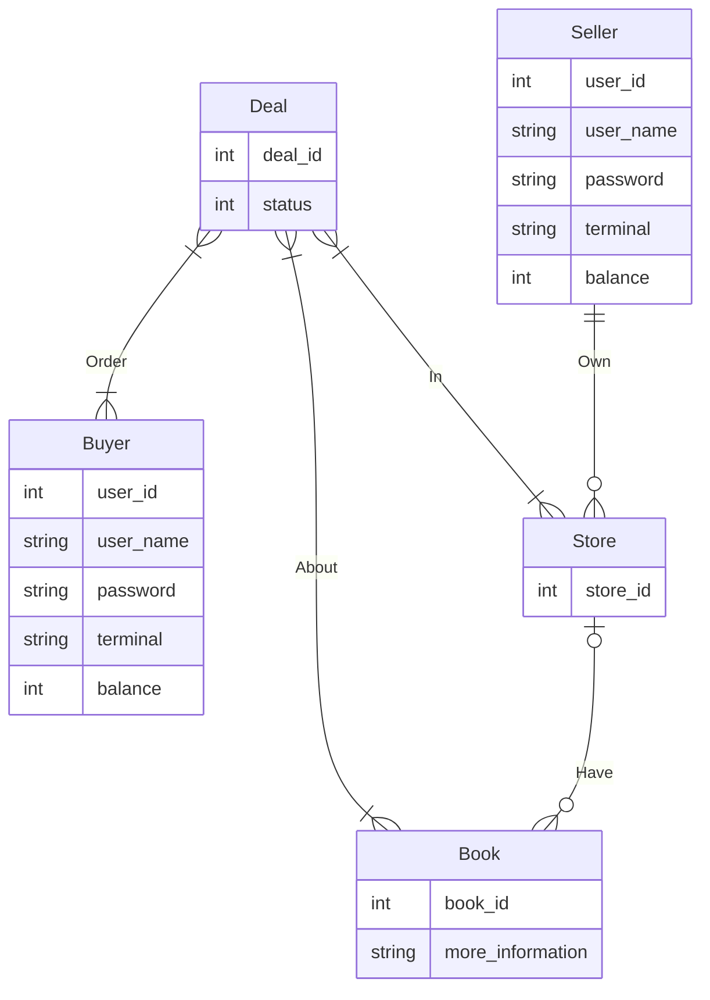
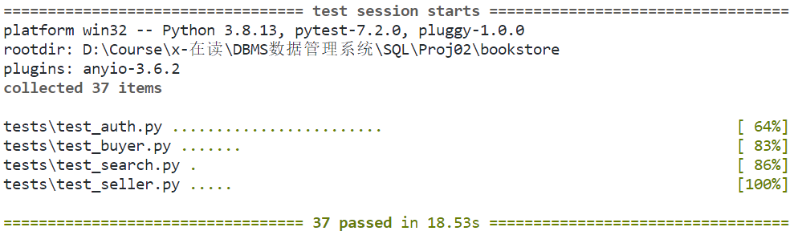

# 第二次大作业

本篇报告按照应用设计到测试的流程攥写. 个别子标题会注明它对应了哪个文件, 代码是谁写的(顺序按照拼音的字典序, 没有大小之分). 

实际工作上经历过几次返回前一步骤重新迭代的过程, 在报告末尾会稍微提及其中的艰难坎坷. 

## 1. 文件结构

本次大作业采用了后端应用常用的MVC结构进行开发. (MVC: 指Model-View-Controller, 是一个非常古老的后端应用设计模板)

其中view层和controller层的代码合在一起, 放在view文件夹下. 

model层放在relations文件夹下, 提供了各种单个事务级别的函数(因而具有原子性), 用于操作表. 

而我们把测试从fe当中拿了出来, 并删除了大量的垃圾代码(200行左右?), 并将重写后修正逻辑错误的测试放在后端的工作目录当中. 

```
.
├── __init__.py
├── relations
│   ├── buyer.py
│   ├── init.py
│   ├── scripts
│   │   ├── book.sql
│   │   ├── name_replacer.py
│   │   └── upload_book.py
│   ├── seller.py
│   └── user.py
├── run.py
├── tests
│   ├── test_auth.py
│   ├── test_buyer.py
│   └── test_seller.py
└── view
    ├── __init__.py
    ├── auth.py
    ├── buyer.py
    └── seller.py
```

## 2. 表设计

### 2.1 业务逻辑(@汤越, 杨天骥, 邹越溪)

从买方用户看来, 他能够查找书本, 购买书本, 查看自己的订单状态, 付款, 退货. 

从卖方用户看来, 他能够创建商店, 添加书本信息(书本信息独立于商店), 将书本放入自己的商店, 收款. 

### 2.2 ER图(@汤越, 杨天骥, 邹越溪)

请参考mermaid的官网来查看relation线的类型和用法. 



### 2.3 从ER图到分表(@汤越, 杨天骥, 邹越溪)

根据结构设计，我们设计数据表如下：

- Buyer
  - uid：买家id，作为主键，自动赋值`autoincrement`
  - uname：买家名
  - pwd：买家密码
  - account：买家账号
  - balance：买家余额
  - token：买家登陆token
  - terminal：买家登陆的terminal

- Seller
  - uid：卖家id，作为主键，自动赋值`autoincrement`
  - uname：卖家名
  - pwd：卖家密码
  - account：卖家账号
  - balance：卖家余额
  - token：卖家登陆token
  - terminal：卖家登陆的terminal

- StoreOwner
  - sid：商店id，作为主键
  - uid：卖家id，作为外键，关联Seller表的uid

- Store
  - sid：商店id，作为外键，关联StoreOwner的sid
  - uid：卖家id，作为外键，关联Seller表的uid
  - bid：书籍id，作为外键，关联Book表的bid
  - price：该书籍在该店的价格
  - inventory_quantity：该书籍在该店的库存量

- Book
  - bid：书籍id，作为主键
  - title：书籍名
  - more info：详细常见book.db作为样例

- Deal
  - did：订单id，作为主键，自动赋值`autoincrement`
  - uid：用户id，买家id，作为外键，关联Book表的uid
  - sid：商店id，作为外键，关联StoreOwner的sid
  - bid：书本id，作为外键，关联Book表的bid
  - order_time：订单下单时间
  - num：下单书籍量
  - status：订单状态
  - money：订单总金额

### 2.4 DDL操作(@汤越, 杨天骥: /relations/init.py)

为了方便测试和后续的修改, 我们将相关的DDL操作封装成了相应的函数. 

每次进行测试时, 通过调用这些操作将表重新初始化. 具体地, 我们向表中导入book.db(作业中提供的从豆瓣上爬下来的图书信息), 并将其他的表重新建表. 

通过这样做, 如果后续发现表当中不能提供功能扩展所需的足够信息或出于性能的考量需要添加冗余列的时, 可以直接修改表对应的类, 而不用手动去数据库中执行操作. 

当然, 在这部分DDL工具函数的开发过程中, 我们也遇到了一些问题, 后来发现是sqlalchemy建表时保留了大写字母, 因此我们书写相应的DROP语句时, 需要将表的名字上加上双引号......

### 2.5 索引(@汤越, 杨天骥: /relations/init.py)

预备知识: 

- 通过运行时反射, python语言中, 能够获取一个类对象(一个类, 但本身是一个对象, 有时也叫cls对象)的所有子类. 

  sqlalchemy实现了这种机制. 首先我们生成一个Base类对象, 而后通过继承它来生成若干个表. 

- sqlalchemy中, 如果规定了多个属性满足primary_key=True, 则为其联合索引创建一个primary_key
- 通过index=True, 可以在单列上创建索引. 

索引和主键加在哪里了? 

- 本来我准备在这里写的, 结果primary_key之类的都被汤越写在前面的表设计里了, 我觉得他写得很清楚, 所以去看2.3吧. 

## 3. 构建应用: Model层接口

Model层接口提供对数据库的原子操作, 之后由View层/Controller层调用这些接口响应前端请求. 

### 3.1 User接口(@邹越溪: /be/relations/user.py)

#### 3.1.1 用户的公共行为

该文件负责用户的公共行为.  结合我们的数据库设计，这里所有的有关用户权限的功能都会分为买家部分和卖家部分，两部分的逻辑是一样的，只是会分别对应不同的数据库. 

- `register`

  传入注册时提供的信息（uname、password、account、balance、token、terminal），如果uname已存在数据库中，那用户将无法注册成功，需要重新换uname. 

- `login`

  传入uname和password，

  - 若uname不存在，或者用户名存在但密码与存入的密码不一致，则login失败
  - 否则，login成功，并且更新token

- `logout`

  因为用户已经登陆成功了，所以logout时不再需要检验用户是否存在，只需要判断用户的token是否一致即可. 

- `unregister`

  传入uname和password

  - 若uname不存在，或者uname存在但输入的密码与存入的密码不一致，则unregister失败
  - 否则，unregister成功，数据库中将删除此用户信息

- `change_password`

  传入uname、old_password、new_password

  - 若uname不存在，或者uname存在但输入的old_password与存入的密码不一致，则change_password失败
  - 否则，change_password成功，数据库中将此用户的密码更新为new_password

#### 3.1.2 用户搜索

在Book表中，显然在4w条数据的大数据情况下，而且很多字段都存储的是很长的字符串，如果粗暴地在Book表中进行关键字搜索，及时是使用了索引，也会导致搜索速度过慢而用户难以忍受的问题，因此为了提升搜索的效率，我们利用冗余，额外用了四个表，分别是search_title, search_tags, search_book_intro, search_author表来存储搜索需要用的东西，同时对想book_intro这样很长的字段，做分词处理，然后做倒排，这样可以有效提高搜索的效率和速度. 

其实在搜索字段中建立索引，然后直接用`like("%xxxx%")`来进行模糊匹配是可行的，但是这样效率低的原因是当碰到比如匹配后缀的时候，我们在搜索字段上建立的索引就失去意义了. 因此我们应该用分词来实现

这里，postgresql本身有一定的分词的功能，但是它并不支持中文. 因此对于中文的分词，有两种方式：使用zhparser插件，或者用jieba. 问了助教老师，zhparser似乎对windows用户不太友好，只能用mac环境装，因此这里选择用jieba来做. 

- `search_title`

  **search_title**表

  | search_id: int | title: str | book_id: int |
  | -------------- | ---------- | ------------ |

  当用户搜索title时，我们现在小表中进行搜索，然后再和大表进行连接，返回用户需要的内容. 同时注意在插入时对空标题进行一定的处理

- `search_title_in_store`

  在search_title的要求上增加store的要求，同时在搜素前需要先判断store是否存在

- `search_tags`

  | search_id: int | tags: str | book_id: int |
  | -------------- | --------- | ------------ |

  这里就用到之前说的分词了，同时在分词之前对tags字段稍微做了些处理，通过正则匹配来去掉所有的除中文、英文外的字符. 然后每个分词分别插入数据库

  ```python
  tmp = re.sub(r'[\(\[\{（【][^)）】]*[\)\]\{\】\）]\s?', '', tmp)
  tmp = re.sub(r'[^\w\s]', '', tmp)
  ```

  

- `search_tags_in_store`

  在search_tags的要求上增加store的要求，同时在搜素前需要先判断store是否存在

- `search_content`

  | search_id: int | book_info: str | book_id: int |
  | -------------- | -------------- | ------------ |

  与search_tags一样先分词，然后再进行搜索

- `searh_content_in_store`

  在search_content的要求上增加store的要求，同时在搜素前需要先判断store是否存在

- `search_author`

  | search_id: int | author: str | book_id: int |
  | -------------- | ----------- | ------------ |

  在这张小表中先搜索，然后再与大表结合

- `search_author_in_store`

  在search_author的要求上增加store的要求，同时在搜素前需要先判断store是否存在

这里其实分词在搜索系统中会很大影响搜索系统的召回率和准确率的. 但如果分词的粒度太细，则会导致消耗的空间很大. 

对于分页显示问题，通过用户前端返回的page(int)参数来判断. 如果page大于0，显示分页结果，用`limit(pageSize).offset(pageSize * (page-1))`来实现；若page=0，则显示全部结果

### 3.2 Buyer接口(@汤越, 杨天骥: /be/relations/buyer.py)

该文件中定义了一些买书人的行为. 

`new_order(user_id: int, store_id: int, id_and_num: List[Tuple[str, int]]) -> Tuple[int, str, List]:`

- 函数概述: 用户下单
- 实现逻辑: 判断用户存在与否，判断店家存在与否，遍历用户要购买的书籍和数量，生成对应的订单，并加入到`Deal`表中

`payment(user_id: int, store_id: int) -> Tuple[int, str]:`

- 函数概述: 用户付钱
- 实现逻辑: 
  - 此外如果订单是过期的, 那么自动ABORT. 
  - 从deal的表中找出所有这个客户刚刚下单的所有图书的信息，并进行传入值检查，如果发现传入值有误，则进行一些列报错. `SELECT * FROM deal WHERE uid=user_id and sid=store_id and status=deal_status["下单"]`
  - 计算这笔交易的总金额为多少,获取用户的账户金额信息，select balance from Buyer where uid=user_id,如果账户金额小于图书总金额，报错，调用error函数
      如果账户金额足够支付，则：
      1. 扣款,更新账户信息 update Buyer set balance = new_balance
      2. 商家的账户进账 update Seller set balance = new_balance
      3. 所有图书的交易记录的状态进行更改 update Deal set status=deal_status["付款"]
      4. 结束commit
  

`add_funds(user_id, pwd，add_value)` 

- 函数概述: 用户充钱
- 实现逻辑: 查询用户信息，进行用户id和密码的匹配，匹配上则进行收付款. 

`receive_book(user_id, sid, did)` 

- 函数概述: 用户收到书籍
- 实现逻辑: 根据用户id和商家id对`Deal`表中的这一单的订单的状态进行修改. 

`history(uid)`

- 函数概述: 用户查询自己已经订过的订单信息

- 实现逻辑: 从`Deal`表中查询所有满足 `Deal.uid == uid` 的行, 返回这些行依字段名转成的字典对象

`cancel_deal(uid, did)` 

- 函数概述: 用户选择取消订单号为`did`的订单
- 实现逻辑: 从 `Deal` 表中查询满足 `Deal.did == did` 的订单
  - 如果商家还未发货, 将书籍的存量还给商家, 将订单状态设为取消0(为什么不是删除? 减少索引的操作)
    - 如果用户已经付款, 则把钱退还给用户, 把商家拿到的钱扣掉. 反之不进行这个操作. 
  - 如果商家已经发货, 返回异常. 
  - 上述操作在一个事务中完成, 而后提交. 

### 3.3 Seller接口(@汤越, 杨天骥: /be/relations/seller.py)

该文件中定义了一些卖书人(商家)的行为: 

`create_store(uid, sid)`

- 函数概述: 为一个商家用户添加一个商店
- 实现逻辑: 在StoreOwner中添加一个(uid, sid)行

`add_book(...)` 

- 函数概述: 可以添加书的信息
- 实现逻辑: 在`Book`表中添加一行带有书信息的行

`add_stock_level(uid, sid, bid, stock_level_delta)` 

- 函数概述: 将书添加入书店, 也可以添加书店中某本书的存量
- 实现逻辑: 更新 `Store` 表: 
  - 如果没有`(书的id: bid, 店的id: sid)`的列, 那么添加一列, 使得price为NULL(这样交易时就会产生Exception而失败, 只有商家主动设置了价格, 这本书才会上架贩卖). 
  - 如果有 `(书的id: bid, 店的id: sid)` 的列, 那么在存量上加上相应的值. 

`change_price(sid, bid, price)`

- 函数概述: 将商店中的某本书价格改为店家制定的价格. 
- 实现逻辑: 更新 `Store` 表: 
  - 如果店家没有上架这本书, 返回异常. 
  - 如果有, 则将这本书的价格改为`price`

`query_stock_level(sid, bid)` 

- 函数概述: 用于查询书店中某本书的存量. 
- 实现逻辑: 查询 `Store` 表中商店id为`sid`, 书id为 `bid` 的表, 返回其存量属性. 

`query_price(sid, bid)`

- 函数概述: 用于查询书店中某本书的价格. 
- 实现逻辑: 查询 `Store` 表中商店id为`sid`, 书id为 `bid` 的表, 返回其价格属性. 

`shipping` 

- 函数概述: 商家发货
- 实现逻辑: 由于购买阶段存货就已经减少, 这里只需要检查用户是否已经付款, 并把交易状态改为发货即可. 

### 3.4 应用层的并发控制(@杨天骥: /be/relations/\*)

应用层也有并发控制的问题. 在现代的后端应用框架中, 往往有自动并发的功能. 这使得即便使用了transaction, 线程之间的竞争也可能使得COMMIT前的指令有交叉. 从而分割了原子性. 为此, 成熟的数据库都配有相应的session机制, 各个session之间满足隔离性. 

这造成了另一个问题: session的开启和关闭都是很贵的操作, 如果每个事务都需要连接开启一个新的session, 那么系统性能会显著降低. 

幸好sqlalchemy提供了一个session池, 通过session maker, 可以从session池当中获得session, 这个session池保证每个session至多被一个线程使用, 并且除非手动关闭, 当前线程会一直持有这个session. 这样, 每个session在一个事务中只会被一个线程写, 保证了没有写交叉的同时, 也避免了session的频繁开启和关闭, 提高了应用的性能. 

## 4. 构建应用: View层接口

### 4.1 User接口(@邹越溪: /be/view/auth.py)

其实本来应该叫user.py的, 但是原来的文件给的是auth.py, 后来想改名字的时候里面的东西已经到处在用了. 

`register`

- 用户（卖家、买家）注册相当于在Seller表或Buyer表中加入一条数据

`login`

- 用户（卖家、买家）登陆相当于在Seller表或Buyer表中修改token

`logout`

- 用户（卖家、买家）登出相当于在Seller表或Buyer表中修改token

`unregister`

- 用户（卖家、买家）注销相当于在Seller表或Buyer表中删除一条信息

`change_password`

- 用户（卖家、买家）改密码相当于在Seller表或Buyer表中修改password值

`search_title`

- 查询Book中已title为标签的所有书的信息

`search_title_in_store`

- 在指定商店中查询以title为标题的book信息

`search_tags`

- 查找包含tag的书

`search_tags_in_store`

- 在指定商店中查找包含tag的书

`search_content`

- 查找包含content的书

`search_content_in_store`

- 在指定商店中查找包含content的书

`search_author`

- 查找author写的书

`search_author_in_store`

- 在指定商店中查找作者为author的书

### 4.2 Buyer接口(@汤越: /be/view/buyer.py)

该文件中是买书者的特殊行为. 

`new_order`

- 函数概述：买家创建一个新订单
- 实现逻辑：调用后端Buyer接口

`payment`

- 函数概述：买家对特定订单进行付款
- 实现逻辑：调用后端Buyer接口

`add_funds`

- 函数概述：买家账号调整余额
- 实现逻辑：调用后端Buyer接口

`receive_book`

- 函数概述：买家收到书后，更改订单状态
- 实现逻辑：调用后端Buyer接口

`history`

- 函数概述：买家查看自己购买书籍的所有记录
- 实现逻辑：调用后端Buyer接口

`cancel_deal`

- 函数概述：买家取消自己已下单但是还未到达的订单
- 实现逻辑：调用后端Buyer接口

### 4.3 Seller接口(@杨天骥: /be/view/seller.py)

该文件中是卖书人的特殊行为. 

`create_store`

- 函数概述: 商家创建一个商店

- 实现逻辑: 调用 `relations` 中的 `add_store` 方法, 

`add_book`

- 函数概述: 添加一本书
- 实现逻辑: 提供书的各种信息, 将书本放入书本表中, 书本表会分配一个书本id给这本书. 同时, 书的信息会被拆分放入检索表, 主要供全文搜索使用. 

`add_stock_level`

- 函数概述: 这个接口可以用于将书本加入商店, 也可以用于增加存量. 

- 实现逻辑: 由于书本在商店中的挂牌价格是NULL, 这本书不会进入之后的交易流程. 

`change_price`

- 函数概述: 商家为商店中的书添加价格. 
- 实现逻辑: 调用relations/seller中的接口. 

`query_stock_level`

- 函数概述: 商家查询书本存量
- 实现逻辑: 调用relations/seller中的接口. 

`shipping`

- 函数概述: 商家发货
- 实现逻辑: 调用relations/seller中的接口, 改变一本书的订单状态

## 5. 测试用例

测试覆盖了每个view接口的每种可能输出(正常+异常情况). 因此测试覆盖率是100%(控制流末端的节点覆盖率). 

更高标准的测试覆盖率计算方法(遍历系统的所有状态链路/遍历系统的所有控制流图中的边, 称为路径覆盖率/边覆盖率), 通常需要运行到地球爆炸才能完成, 当然我们并没有追求这个些标准上的测试覆盖率. [关于测试覆盖率类型, 请参考wikipedia](https://zh.wikipedia.org/zh-hans/%E4%BB%A3%E7%A2%BC%E8%A6%86%E8%93%8B%E7%8E%87#%E5%9F%BA%E6%9C%AC%E7%9A%84%E8%A6%86%E7%9B%96%E7%8E%87%E5%87%86%E5%88%99)

### 5.1 用户公共行为(@邹越溪: /be/tests/test_user.py)

`test_seller_register`

- 卖家注册. 若uname存在则报错，否则即成功

`test_buyer_register`

- 买家注册. 若uname存在则报错，否则即成功

`test_seller_login`

- 卖家登陆，需要卖家先注册，判断密码是否相同

`test_buyer_login`

- 买家登陆，需要买家先注册，判断密码是否相同

`test_seller_logout`

- 卖家登出，需要卖家先注册，然后登陆，判断token是否相同

`test_buyer_logout`

- 买家登出，需要买家先注册，然后登陆，判断token是否相同

`test_seller_unregister`

- 卖家注销，需要卖家先注册然后才能注销

`test_buyer_unregister`

- 买家注销，需要买家先注册然后才能注销

`test_seller_changepassword`

- 卖家改密码，需要卖家先注册，然后判断输入的密码是否正确才能改密码

`test_buyer_changepassword`

- 买家改密码，需要买家先注册，然后判断输入的密码是否正确才能改密码

### 5.2 买书人行为(@汤越: /be/tests/test_buyer.py)

`test_initialization`

- 被测功能：因用户在进行购买时需要在店铺进行购买，所以测试用户功能前，需确保预先的用户登陆、商店创建 、书籍添加、书籍调整等功能的正确性. 此测试作为后续测试的预测试

`test_new_order`

- 被测功能：用户进行新订单的购买. `/be/relations/buyer/new_order`，在预测试已经准备好的商店中购买书籍， 测试用户购买后能够正确写入订单信息到`Deal`表中

`test_payment`

- 被测功能：用户针对订单付款. `/be/relations/buyer/payment`，在用户已购买书籍形成订单后根据订单的价格信息对用户的账户进行扣款，测试`Buyer`表中成功扣款

`test_add_funds`

- 被测功能：用户账户添加余额. `/be/relations/buyer/add_funds`，对特定用户的账户增加或减少资产，测试能够成功增加或减少`Buyer`表中该用户的资产

`test_receive_book`

- 被测功能：用户已接受到书，修改订单状态. `/be/relations/buyer/receive_book`，测试`Deal`表中的订单状态已被修改为“收货”

`test_history`

- 被测功能：用户订单历史记录测试`/be/relations/buyer/history`，从`Deal`表中查询某一用户的历史订单信息

`test_cancel_deal`

- 被测功能：用户取消订单测试. `/be/relations/buyer/canceal_deal`，从`Deal`表中取消某位用户的订单，将订单状态修改为`取消`

### 5.3 卖书人行为(@杨天骥: /be/tests/test_seller.py)

`test_create_store_ok`

- 函数概述: 创建商店成功的测试用例
- 实现逻辑: 首先创建用户, 而后让该用户创建商店, 断言操作成功

`test_create_store_dup`

- 函数概述: 创建商店重复而失败的测试用例
- 实现逻辑: 首先创建用户, 而后创建两个同名的商店, 断言操作失败

`test_add_book`

- 函数概述: 添加新书成功的测试用例
- 实现逻辑: 首先创建用户, 而后随机生成一本书的信息并插入, 断言操作成功

`test_add_stock_level`

- 函数概述: 将书本加入商店的测试用例
- 实现逻辑: 首先类似 `test_add_book` 创建一本书, 并创建商店, 将书本加入商店, 断言操作成功. 

`test_change_price`

- 函数概述: 为书本赋上价格的测试用例
- 实现逻辑: 首先类似上面的操作, 先将书放到店里, 而后

### 5.4 测试结果

我们每个测试都会把表初始化一遍, 因此花的时间有很大一部分在这个上面. 



## 6. 小结

### 6.1 关于版本管理和流程管理

版本管理: 

- 我们采取了git作为版本管理的工具. 可以清晰看到每个人做了什么, 当然翻车的时候也方便回滚到之前的历史. 

- 仓库连接：https://github.com/TOMYUE/CDMS_bookstore/tree/main . 

流程管理: 

- 我们的分工基本上是骰子决定的, 工作分配是几乎完全均匀的. 

- 大致是首先用一周半写了前60%的功能, 而后用一周半写了后面40%的功能, 非常peace和顺滑, 减少了ddl前熬夜突击的情况. 

### 6.2 我们完成了哪些作业要求

你看下面这些项这样加起来就是满分了! 请给我们A并且把附加分加满! 谢谢你! 

\[60%\] 前百分之六十的功能要求

- \[15%\] 用PostgreSQL替换SQLite后端
  - \[10%\] 用ORM的方式实现了建表
  - \[5%\] 将给的数据中的`book.db`导入了阿里云上的PostgreSQL
- \[40%\] 用ORM的方法, 将SQL语句改写为对ORM的操作, 重写后端接口
  - \[40/3%\] 将auth模块重写了(model+view)
  - \[40/3%\] 将buyer模块重写了(model+view)
  - \[40/3%\] 将seller模块重写了(model+view)

\[40%\] 后百分之四十的功能要求+流程要求

- \[25%\] 附加功能: 
  - \[10%\] 实现买书人在全局搜索和店内搜索
  - \[10%\] 实现买书人查询订单, 退货等操作
  - \[5%\] 实现买家发货, 卖家收获的流程
- \[10%\] 考虑索引, 考虑提高应用性能的方法: 
  - \[5%\] 我们建表时考虑了索引的代价, 哪些项会频繁插入删除, 最后得到了表结构
  - \[5%\] 我们使用了SQLAlchemy提供的session池来管理链接, 防止session反复建立和断开
- \[5%\] 使用Git等版本管理工具: 用了用了, 你看上一个小节

### 6.3 小组成员们的感想

邹越溪: 

- 加强了orm的理解与运用. 同时加深了对搜索操作的理解，尤其是分词和索引方面. 
- 其实postgresql中还有不同的索引类型比如2-gram等，不同的索引也会影响搜索的召回率. 

汤越: 

- 对于关系型数据库的表设计有了更好的理解
- 对于python读取文件的坑有了更多了解，对SQLAlchemy的常见使用方式的出错情况有了一定的了解，针对前后端项目的debug能力有一定提升

杨天骥: 

- 有点收获: 大致了解了后端应用开发中使用数据库的方法. 
- 有点收获: 对如何写出高性能的事务处理语句有了初步的思考. 
- 有点怨气! 知道了很多(更多)SQLAlchemy使用中的坑. 
  - 例如, Query对象的filter方法并不支持python原生的逻辑表达式, 虽然可以运行, 但是它只会看第一个命题. (为什么它不把这看成异常...这不故意坑人吗)
  - 例如, DROP的时候不带引号会寄
  - 例如, 返回出来的对象有的时候是字典有的时候不是
  - 例如, 设置某个元素为主键, SQLAlchemy会采取一些Shortcut来优化查询, 有时和业务逻辑不匹配, 导致很难排查的异常. 
  - 对的, 这些坑都是我发现并且告诉组员的, 我可厉害了. 

- 有点开心! 8月份以来就没怎么和同学一起写代码了, 感觉能见面的活人比github上的赛博朋友有意思, 毕竟是活的人! 3D的人! 

